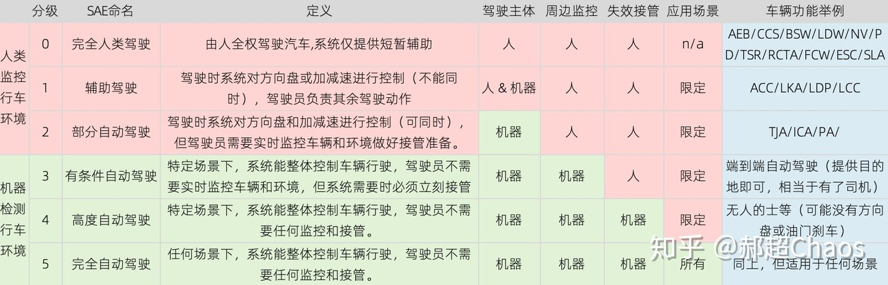
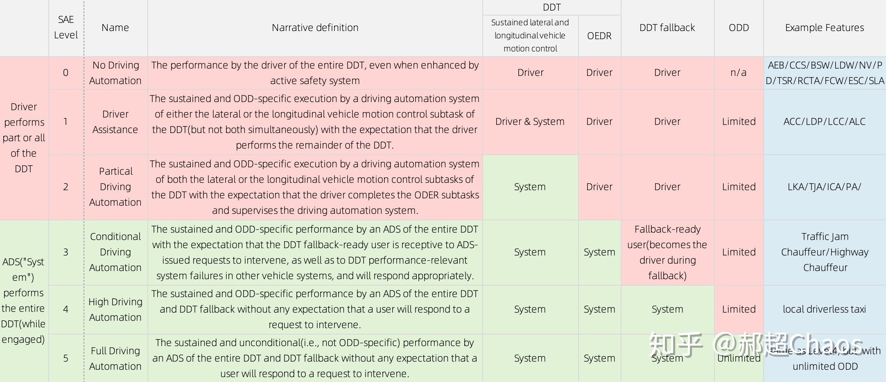
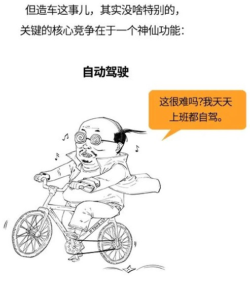
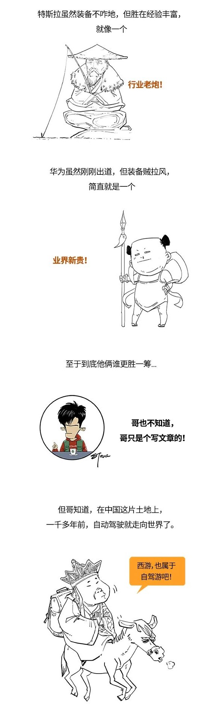

# 自动驾驶

## ADS vs ADAS

* `ADS`=`Automated Driving System`=`自动驾驶系统`
  * 通过配置的软硬件，车辆在行驶时完全实现自动控制，自动驾驶系统仅适用于L3,L4,L5
    * 只要驾驶员还需要实时监控车辆和周围的环境，自动驾驶就依然停留在L3以下的层次
* `ADAS`=`Advanced Driving Assistant System`=`高级驾驶辅助系统`
  * 车辆通过在车身布置传感器，帮助驾驶员以最快时间察觉危险，是提高安全性的主动安全技术
* `ADS` vs `ADAS`
  * 结论：ADS > ADAS
      * `ADS`的各种功能
        * `L0`：AEB、CCS、BSW、LDW、NV&PD、TSR、RCTA、FCW、ESC、SLA
        * `L1`：ACC、LKA、LDP、LCC、Summon
        * `L2`：TJA、ICA、PA、IE
        * `L3`：自动驾驶（人在驾驶座）
        * `L4`：自动找车位（车上无人）
        * `L5`：完全自动驾驶
  * 品牌对比
    * 无论是理想，蔚来还是标准版特斯拉，都还在L2
    * 特斯拉升级后可以达到L3甚至是准L4
      * 原文中特斯拉在美国某些条件下可以到L4。暂时存疑

## `ADS`=`自动驾驶系统`

* 概述
  * 
    * 
* 一句话解释
  * 让车自己开，不需要人驾驶
    * 
* 相关概念
  * DDT: Dynamic Driving Task，动态驾驶任务。即车辆的行驶任务，包括加减速停车和大方向
  * ODD: Operational Design Domain，设计运行域。也就是应用场景，ODD-specific就是特定应用场景下，比如市区高速、封闭园区等
  * DTT fallback：Dynamic Driving Task fallback，动态驾驶任务应变计划
    * 当系统失效时，需要有办法提供风险最小化的应对方案。L4 & L5的DTT fallback由机器应对，其余级别由人应对
* 对比
  * 华为 vs 特斯拉
    * 
