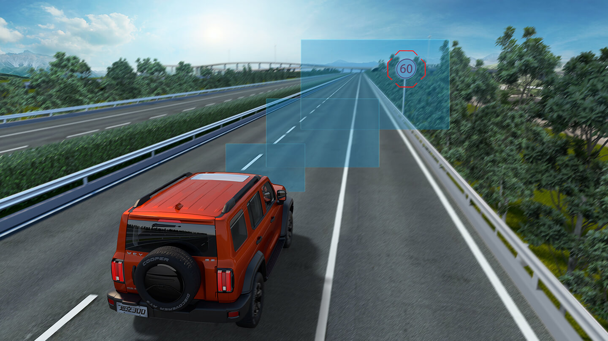
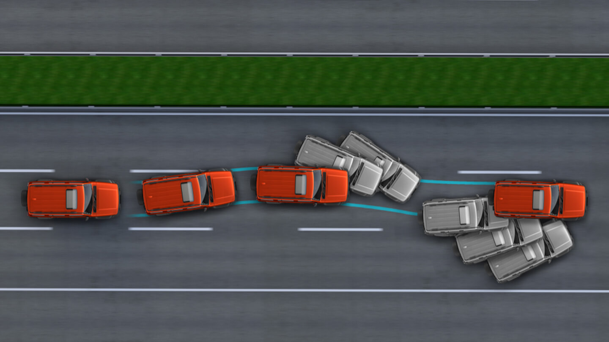
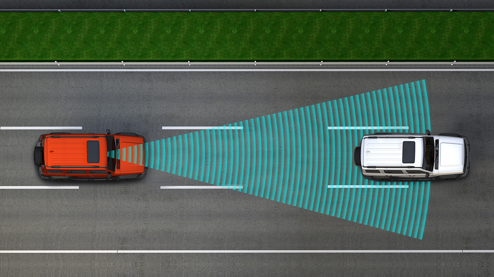
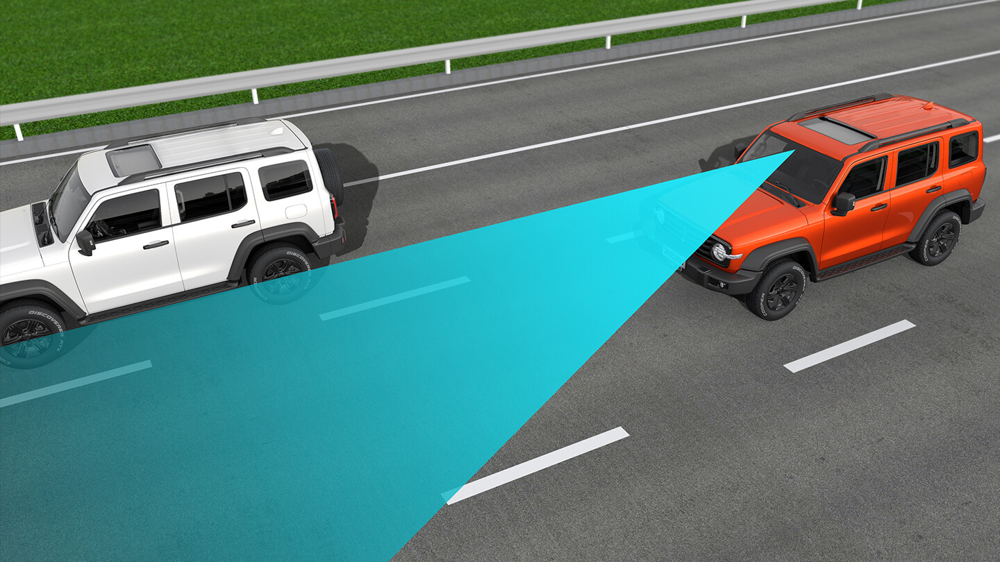
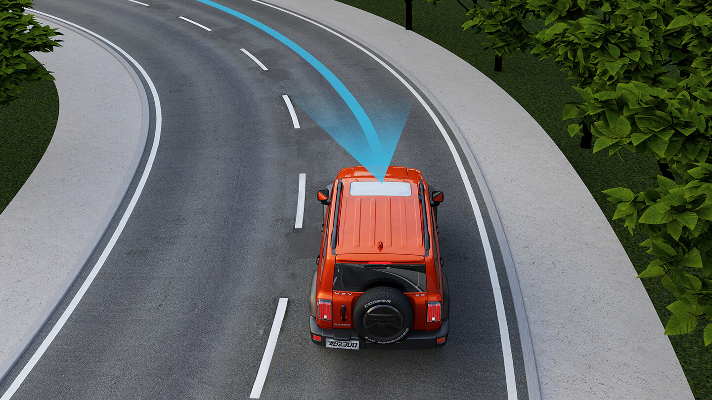
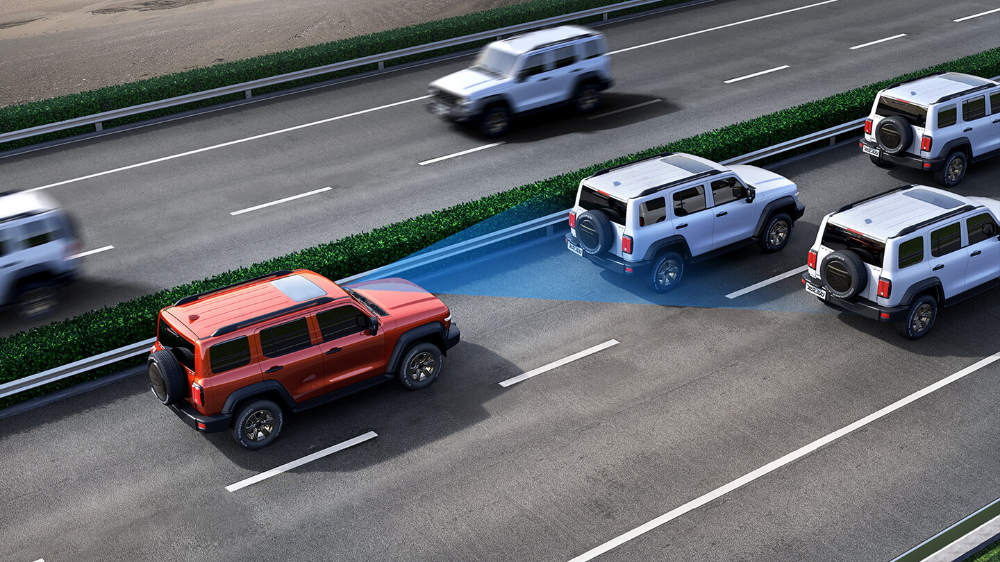
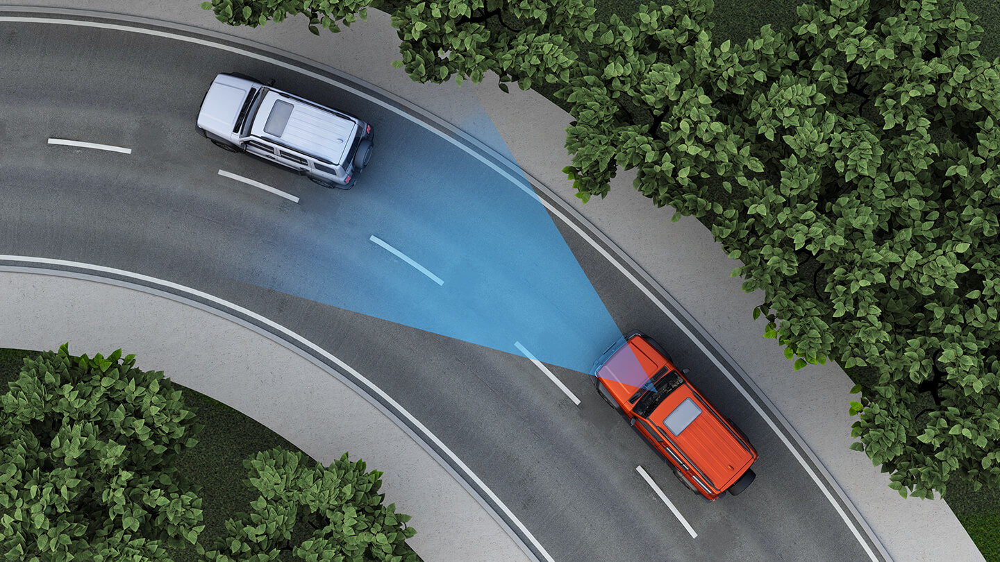
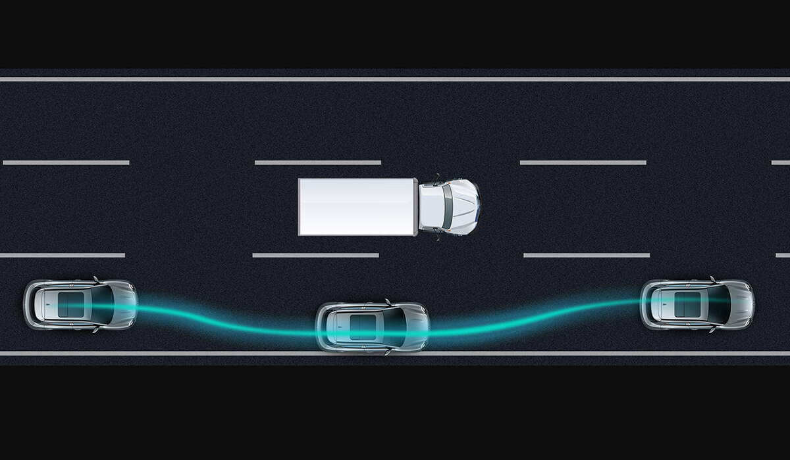
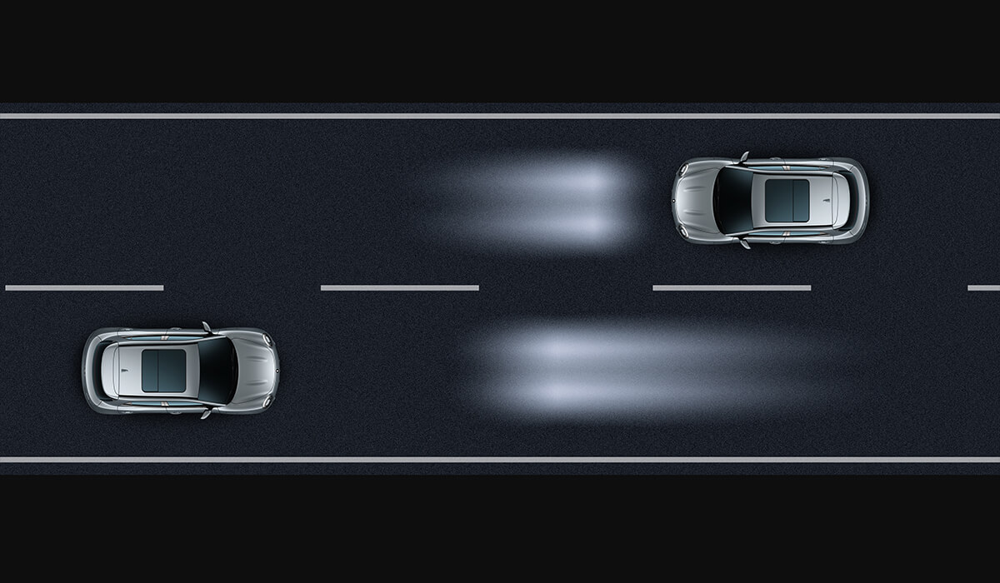

# 不同等级和常见功能

* 自动驾驶的常见等级和功能
  * L0：完全人来驾驶
    * 概述
      * 但系统会提供短暂警示和车控。比如变道提醒、碰撞预警、夜视系统等警示和增强功能，或者自动紧急制动、定速巡航等短时车辆控制功能。人负全责
    * L0功能举例
      * AEB：自动紧急制动，Automatic Emergency Braking。
      * CCS：定速巡航，Cruise Control System。
      * BSW：变道盲点预警，Blind Spot Warning。
      * LDW：车道偏离警告，Lane Departure Warning。
      * NV&PD：夜视和行人检测，Night Vision & Pedestrian Detection。
      * TSR=交通标志识别=Traffic Sign Recognition
        * 
      * RCTA：后方横向来车警报，Rear-Cross Traffic Alert。
      * FCW：前向碰撞预警系统，Forward Collision Warning。
      * ESC=车身电子稳定系统，Electronic Stability Control
        * 别称：ESP
          * 
      * SLA：限速辅助，Speed Limit Assist
  * L1：辅助驾驶
    * 概述
      * 系统能控制拐弯或加减速的一个，不能同时控制
        * 炒的火热的ACC自适应巡航就是只能控制加减速，无法控制拐弯。
        * LDP车道偏离预防，也只是偏离车道时控制方向盘纠正一下轨迹，不能同时控制车速。
      * 人负全责
    * L1功能举例
      * ACC=自适应巡航控制=Adaptive Cruise Control
        * 
      * ATC
      * LKA：车道保持辅助，Lane keep Assist
        * 
      * LDP：车道偏离预防，Lane Departure Prevention。
      * LCC：车道居中控制，Lane Center Control
        * 别称：LCK=车道居中保持=Lane Center Keep
          * 
      * Summon：车辆召唤
        * 视频
          * https://www.zhihu.com/video/1112394878348234752
  * L2：部分自动驾驶
    * 概述
      * 系统可以同时控制加减速和转弯了，但司机的眼和耳必须时刻监测路面和车辆，手脚做好随时接管准备。不管是TJA交通拥堵辅助、还是PA自动泊车、ICA智能巡航辅助，虽然实现了加减速和转向的同时控制，但会有很多失效情况发生，比如路口信号灯、前车直行而你却要转向等，所以需要司机时刻准备接管。人负全责
    * L2功能举例：
      * TJA：拥堵辅助驾驶，Traffic Jam Assist
        * 
      * ICA：智能巡航辅助，Intelligent Cruise Assist
        * 功能：可自适应加减速并保持车道（ACC+LKA）
          * 
        * 自动变换车道
          * 视频
            * https://www.zhihu.com/video/1112394309332090880
      * PA：自动泊车，Parking Assist。司机确认要倒入车位后，车辆自动倒车入库（此时司机可下车监控车辆，随时准备用手机控车）
        * 视频
          * https://www.zhihu.com/video/1112393657382154240
      * IE=智慧躲闪
        * 相邻车道为大型车辆时（大货车、大客车等），车道内根据相对距离与车速向远离大车方向躲闪一定距离，有效降低刮蹭或碰撞风险。
          * 
      * HMA=智能灯光辅助
        * 根据环境亮度自动开启大灯，同时行车时远近光灯智能自动切换，提高会车安全
          * 
  * L3：有条件自动驾驶
    * 概述
      * 某些道路、环境下，只要给个目的地，就可以完全让系统来完成从几点到终点的驾驶，司机不用观察路况，但必须坐在驾驶位置上
      * 特殊情况时，系统提前会发出警报让司机接管车辆，在司机回过神到完全接管车的几秒内，系统依然保持对车辆的安全控制。系统驾驶时系统负全责，但系统提示需要接管的且几秒内司机未接管，则司机负全责
    * L3功能
      * 自动驾驶（人在驾驶座）
        * 视频：
          * https://www.zhihu.com/video/1112398090291646464
  * L4：高度自动驾驶
    * 概述
      * 某些道路、环境下（园区、某段高速或某片政策允许的城市道路），只要给个目的地，就可以完全让系统来完成从起点到终点的驾驶，司机不用观察路况，也不必须坐在驾驶座，车上甚至可以不装方向盘和油门&刹车。车负全责
    * 说明
      * Tesla在美国某些道路可以做到L4，但到中国就不行。跟地图精度、政策法规密切相关
    * L4功能
      * 自动找车位（车上无人）
        * https://www.zhihu.com/video/1112396599535345664
  * L5：完全自动驾驶
    * 概述
      * 在所有道路所有环境下都可以实现全部由系统控制的自动驾驶。也就是大众心中自动驾驶最终的样子
