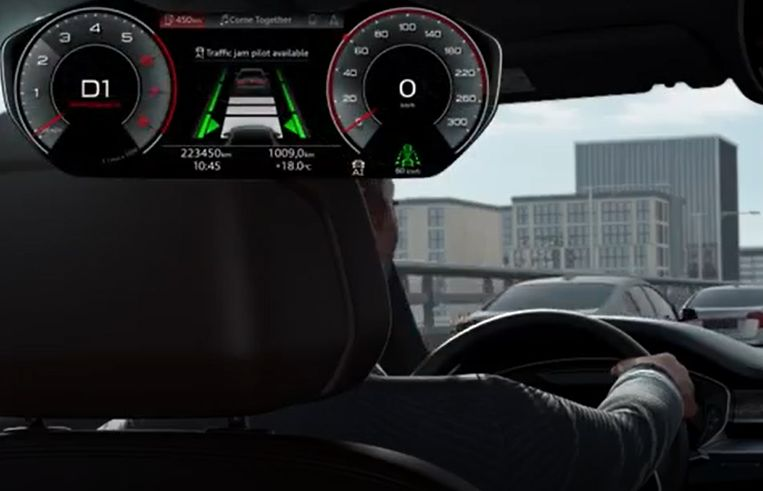
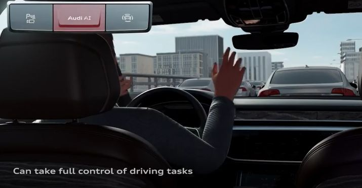
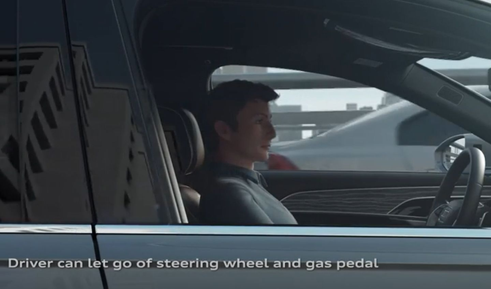
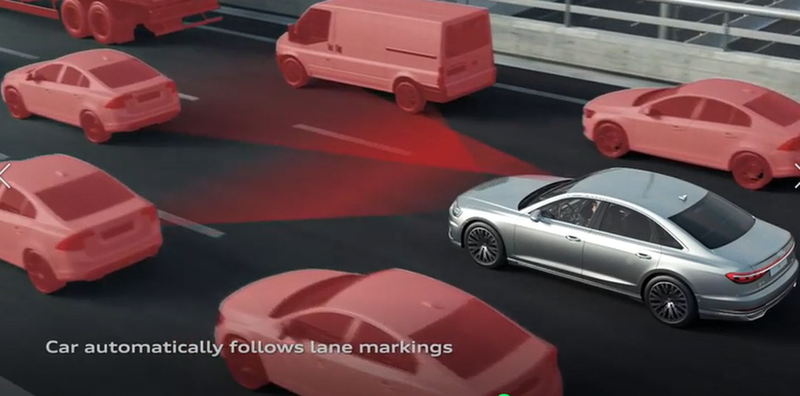
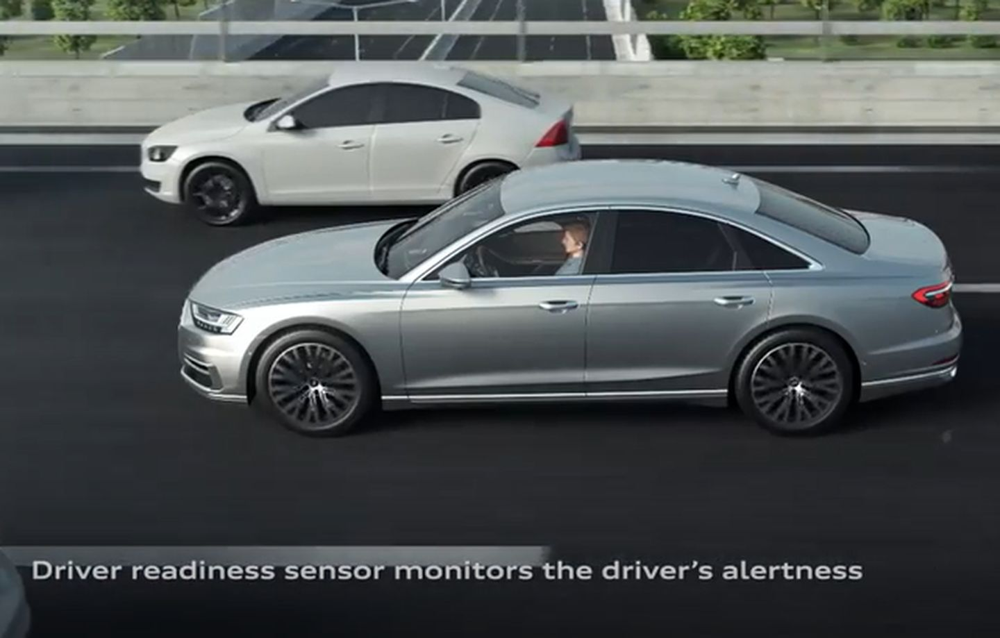
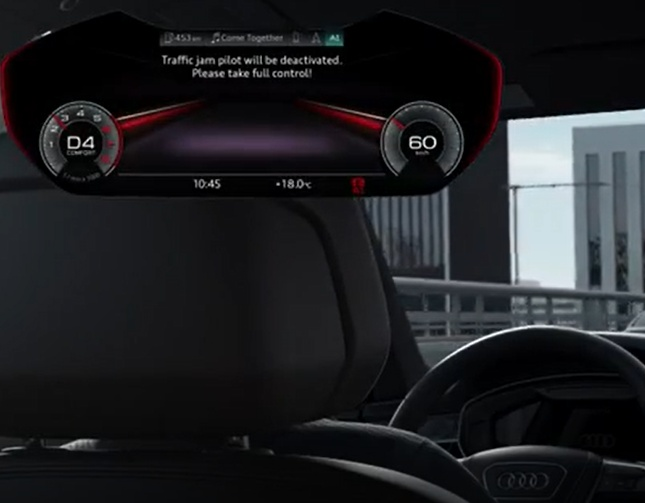
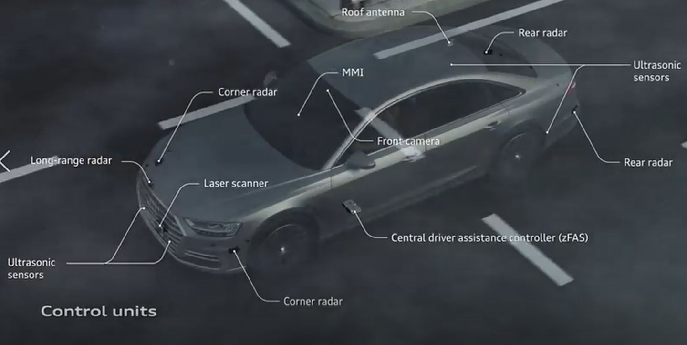
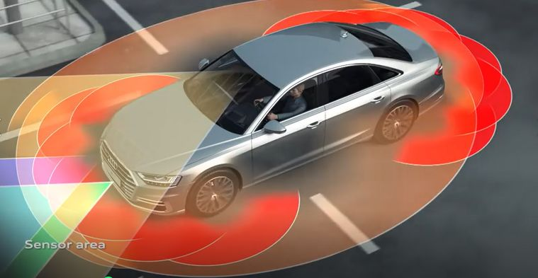
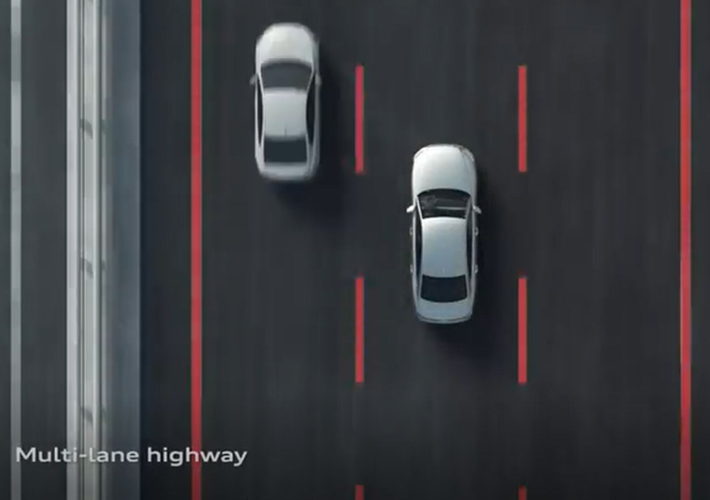
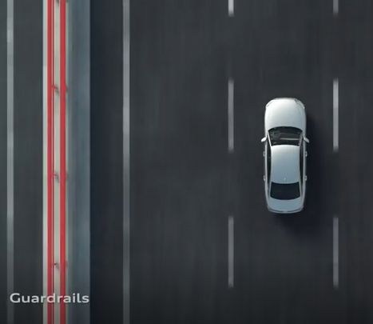

# TJA交通拥堵辅助系统

* TJA
  * 作用：在堵车时候，为驾驶员提供一定的辅助系统，缓解驾驶员的疲劳
    * 它是ACC功能的一个拓展版，可以跟ACC一样走走停停，但增加了轻微转向调整的功能
  * 触发和关闭的条件：在车速低于65km/hr的时候，系统可以触发该功能
  * 功能安全性：TJA属于驾驶辅助系统，驾驶员要做好接管车辆超控的准备
  * 功能演示
    * 视频
      * https://www.zhihu.com/video/1196385126706307072
    * 过程
      * TJA系统触发
        * 在满足一定的条件后，TJA系统会在仪表盘上提示：“Traffic Jam Pilot available”
          * 
        * Audi车子上面会有一个“AUDI AI”的物理键，一键可触发TJA功能，系统接管车辆的控制，但是人必须将双手放于方向盘上，准备随时接管车辆的控制
          * 
          * 这时候车辆控制系统可以控制汽车的转向和油门等活动
        * 车辆会根据策略，保持跟车车距，并时刻监测是否有加塞的车辆插入，做车辆转向微调和跟车动作
          * 
        * 同时，传感器也会监测驾驶员随时接管汽车控制系统的就绪状态，防止驾驶员过于信任TJA系统，而疏忽大意，放任自流
          * 
          * 
      * TJA系统关闭
        * 在完成交通堵塞辅助任务后，系统会提示驾驶员：Traffic Jam Pilot will be deactivated, Please take full control!!"
          * 
  * 传感器(感知的物理器件）
    * 超声波雷达、毫米波雷达、前视摄像头等
      * 
    * 传感器的覆盖区域
      * 
    * 毫米波雷达感知车道线和路边的栅栏
      * 
      * 
* 哪些情况下TAJ功能无法激活
  * 包括
    * 驾驶员双手离开方向盘（在一个指定时间内，探测不到方向盘上有平衡力矩）
    * 可供使用的车道宽度不足 （终于知道了为什么上文写到要监测路宽吗）
    * 车道转弯半径<150m
    * 车辆与车道边缘距离过小（终于知道了为什么上文写到要监测栅栏和路边界）
    * 前行车道长度不足
  * 当有上述情况达到系统策略的极限值时候，系统会发报警信息给驾驶员，请求驾驶员接管车辆控制。
  * 如果驾驶员始终没有任何反应的时候，系统会以-2m/s²的加速度逐渐平稳减速，直至触发ESC停车，同时闪烁警告灯。
* 支持TJA的车型
  * 长城 `坦克300`
  * 一汽大众 `探岳`
