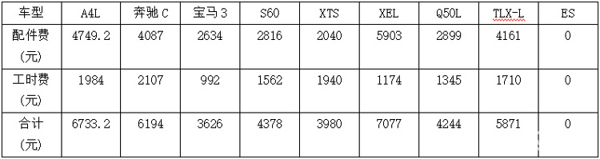

# 汽车通用逻辑

此处介绍关于汽车方面的通用的逻辑和概念。

* 汽车通用的操作逻辑
  * 左右转向灯
  * 雨刮器
  * 空调
    * 冷风
    * 热风
  * 空气循环
    * 内循环
    * 外循环
  * 等等
* 养车花费
  * 保险费
    * 交强险
    * 商业险
  * 保养费
    * 平均每 3~12月 保养一次
      * 每次平均 500元~5000元+
        * 具体取决于保养类型（大保、小保）和你的车子档次=价位
    * 举例
      * 豪车
        * 部分豪车5万公里大保的费用对比
          * 
  * 加油费
  * 停车费
  * 维修费
    * 举例
      * 某人2015款奔驰C300
        * 换大灯：4S店要4.8万，最后修理厂花8千
        * 换散热器：4S店要7千+人工3千共1万，最后修理厂花3千
        * 换后窗玻璃：直接修理厂花3千
  * 其他
    * 罚款
