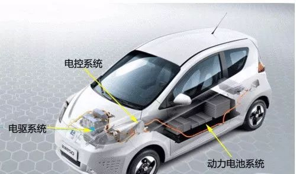
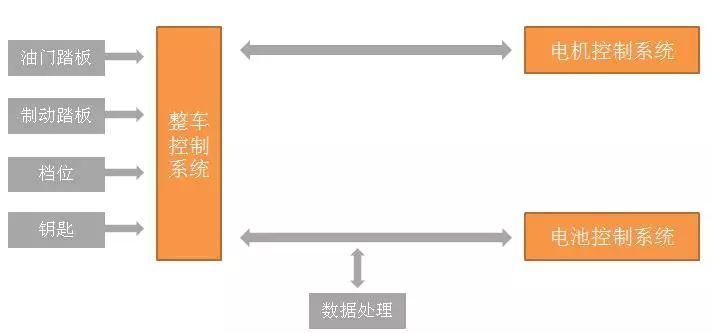
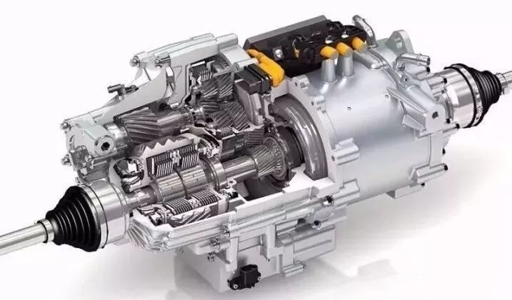
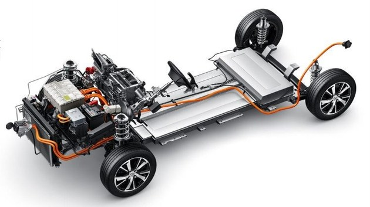
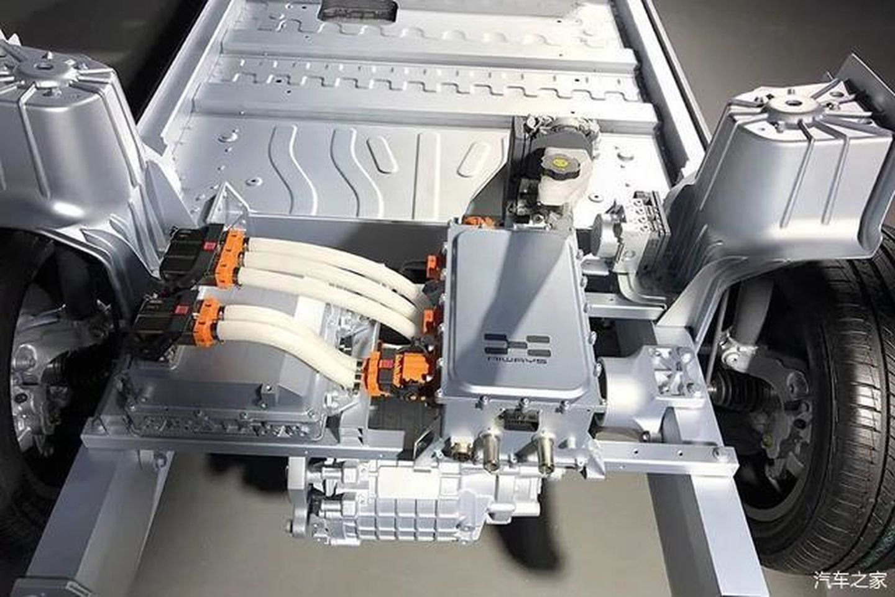
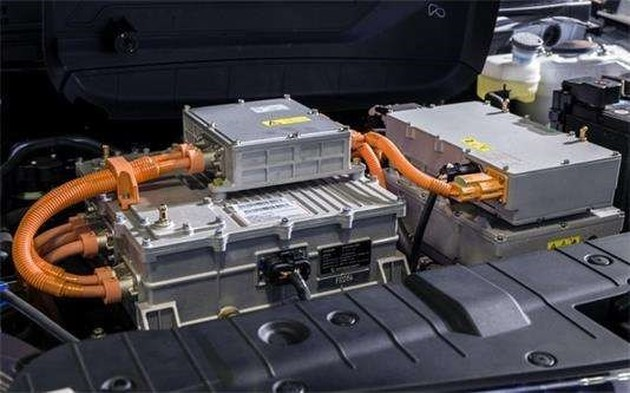

# 电动车

## 分类

## 组成

* 电动车的三大件 = 三电系统 ：电机、电控、电池
  * 架构
    * 
    * 
  * 原因
    * 三电系统的成本占据整辆纯电动车总成本的75%以上
    * 超过90%的纯电动车机件故障，也都是由三电系统引起

* 对比

| 电动车 | 燃油车 | 人 |
| ----- | ----- | -- |
| 电机 | 发动机 | 心脏 |
| 电控 | ECU=动力控制单元=发动机控制器 | 大脑 |
| 电池 | 汽油=油箱 | 血液+肌肉 |

* 详解
  * 电机 = 电驱
    * 
  * 电控
    * 含义
      * 狭义：VCU
      * 广义：VCU + BMS + 等
    * 作用：采集油门、制动等多种信号，并作出相应判断和发出指令
    * 架构
      * 
      * 
  * 电池
    * 

