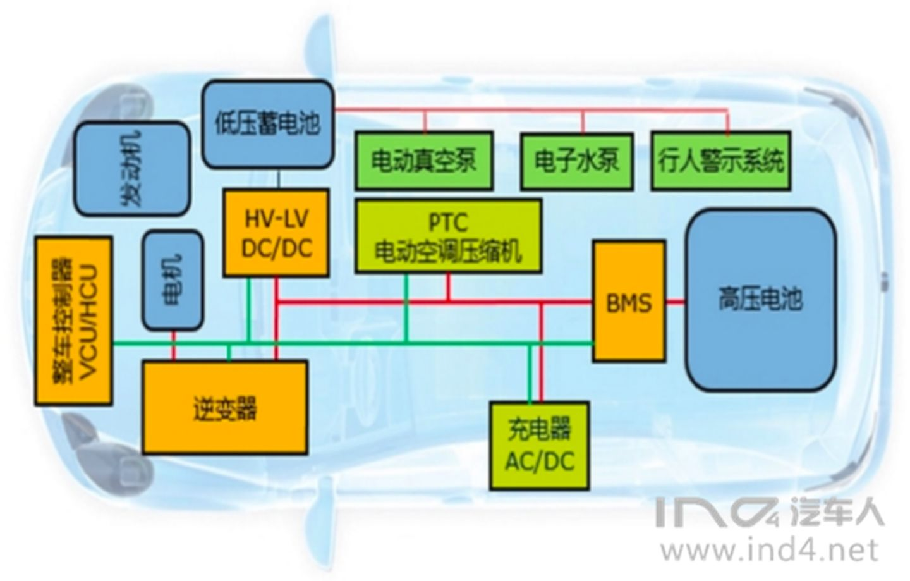
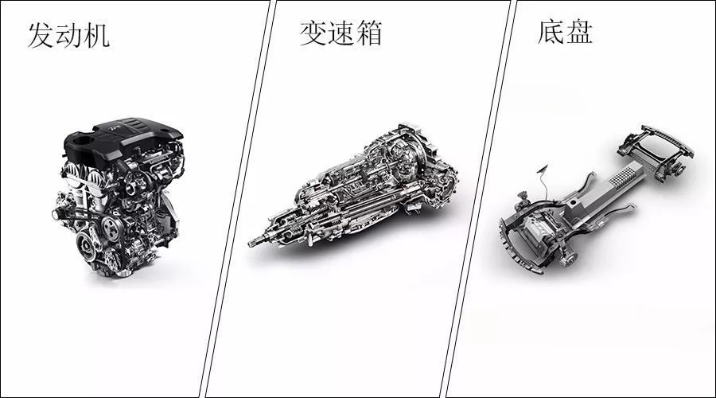
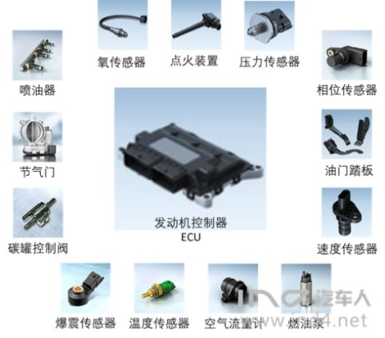

# 燃油车

* 燃油车
  * 名称
    * 简称：汽车 = 普通汽车
    * 别称：传统燃油车
    * 全称：`ICEV`=传统内燃机汽车
  * 分类
    * 根据燃油类型分
      * 汽油
        * 传统汽油车
      * 柴油
        * 柴油车

## 组成

* 总体架构
  * 
* 三大件：底盘、发动机、变速箱
  * 概述
    * 架构
      * 
  * 详解
    * 底盘
    * 发动机
    * 变速箱
* 其他
  * VCU=Vehicle Control Unit=车辆控制单元=整车控制器
    * 别称：ECU=发动机控制器
    * 作用：从驾驶意图的获取到能源的供给再到能量的转化，几乎全部功能都由发动机控制器来完成
    * 架构
      * 
  * BMS=电池管理系统
